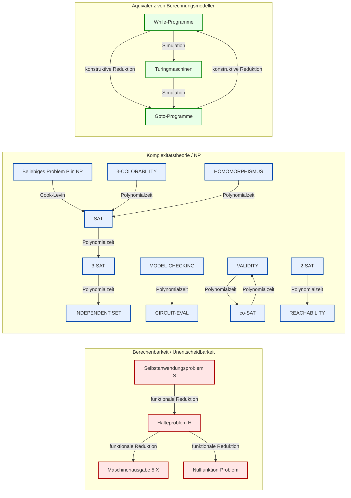
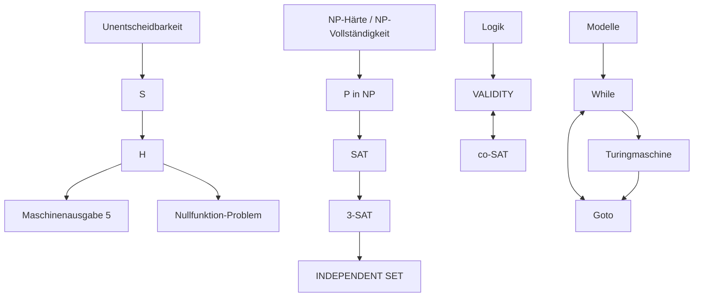

```mermaid
flowchart LR

%% -------------------------
%% Berechenbarkeit / Unentscheidbarkeit
%% -------------------------
subgraph B["Berechenbarkeit / Unentscheidbarkeit"]
    S["Selbstanwendungsproblem S"]
    H["Halteproblem H"]
    X["Maschinenausgabe 5 X"]
    Null["Nullfunktion-Problem"]
    
    S -->|"funktionale Reduktion"| H
    H -->|"funktionale Reduktion"| X
    H -->|"funktionale Reduktion"| Null
end

%% -------------------------
%% Komplexität / NP
%% -------------------------
subgraph K["Komplexitätstheorie / NP"]
    NP["Beliebiges Problem P in NP"]
    SAT["SAT"]
    TSAT["3-SAT"]
    IS["INDEPENDENT SET"]
    MC["MODEL-CHECKING"]
    CE["CIRCUIT-EVAL"]
    VAL["VALIDITY"]
    COSAT["co-SAT"]
    COLOR["3-COLORABILITY"]
    HOM["HOMOMORPHISMUS"]
    TWO["2-SAT"]
    REACH["REACHABILITY"]

    NP -->|"Cook-Levin"| SAT
    SAT -->|"Polynomialzeit"| TSAT
    TSAT -->|"Polynomialzeit"| IS

    MC -->|"Polynomialzeit"| CE

    VAL -->|"Polynomialzeit"| COSAT
    COSAT -->|"Polynomialzeit"| VAL

    COLOR -->|"Polynomialzeit"| SAT
    HOM -->|"Polynomialzeit"| SAT
    TWO -->|"Polynomialzeit"| REACH
end

%% -------------------------
%% Berechnungsmodelle
%% -------------------------
subgraph M["Äquivalenz von Berechnungsmodellen"]
    WHILE["While-Programme"]
    GOTO["Goto-Programme"]
    TM["Turingmaschinen"]

    WHILE -->|"konstruktive Reduktion"| GOTO
    GOTO -->|"konstruktive Reduktion"| WHILE
    WHILE -->|"Simulation"| TM
    TM -->|"Simulation"| GOTO
end

%% Styling
classDef undecidable fill:#ffe6e6,stroke:#aa0000,stroke-width:2px;
classDef complexity fill:#e6f0ff,stroke:#0044aa,stroke-width:2px;
classDef models fill:#e8ffe8,stroke:#008000,stroke-width:2px;

class S,H,X,Null undecidable;
class NP,SAT,TSAT,IS,MC,CE,VAL,COSAT,COLOR,HOM,TWO,REACH complexity;
class WHILE,GOTO,TM models;
```

```mermaid
flowchart TD

A["Unentscheidbarkeit"]
A --> S["S"]
S --> H["H"]
H --> X["Maschinenausgabe 5"]
H --> N["Nullfunktion-Problem"]

B["NP-Härte / NP-Vollständigkeit"]
B --> NP["P in NP"]
NP --> SAT["SAT"]
SAT --> TSAT["3-SAT"]
TSAT --> IS["INDEPENDENT SET"]

C["Logik"]
C --> VAL["VALIDITY"]
VAL <--> COSAT["co-SAT"]

D["Modelle"]
D --> WHILE["While"]
WHILE <--> GOTO["Goto"]
WHILE --> TM["Turingmaschine"]
TM --> GOTO
```

![[Reduktionen.canvas]]